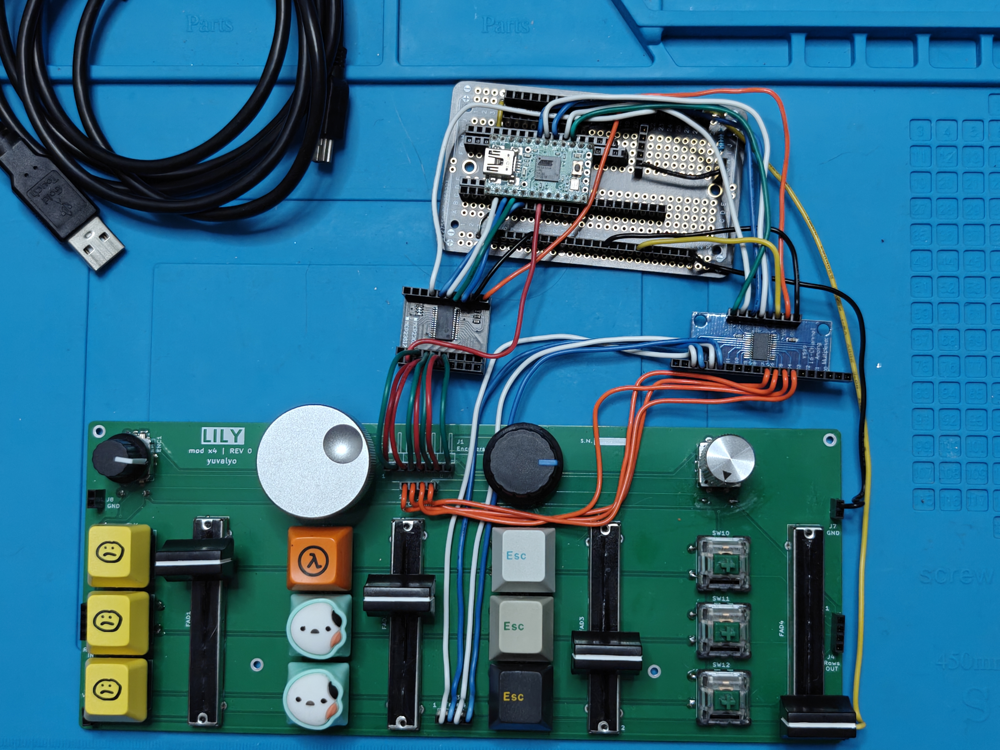
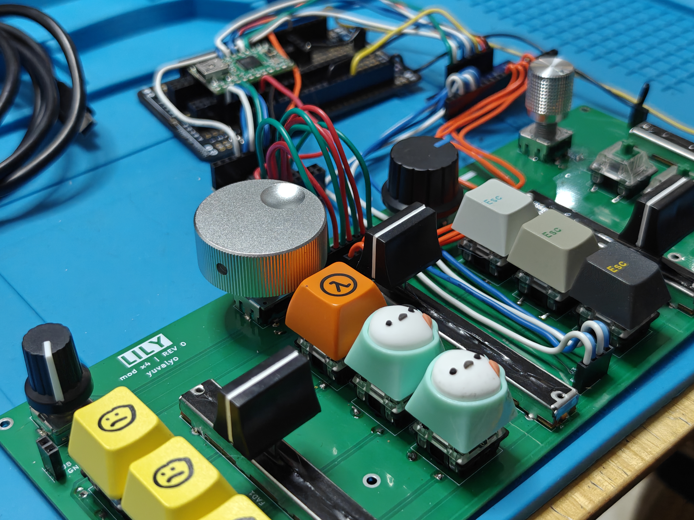

# MIDI controller based on ATmega32U4 MCU

From concept to product - documentation and learning process

Going all the way in the supply chain from proof of concept to prototyping with custom breakout boards and producing the final PCB including design, layout, assembly and testing.
In this process ...

Features:
- Sends standard MIDI messages 
- Rotary Encoders with pushbuttons
- Cherry MX switch matrix
- 45mm slider potentiometers
- RGB LED fader feedback

Specifications:
- ATmega32U4 MCU
- Native USB device and HID compliant 
- Type-C plug with over-current protection 
- MCP23S17 SPI GPIO expander for rotary encoders
- CD4067 16-channels multiplexer for switch matrix and faders

Libraries used:
- FastLED
- ResponsiveAnalogRead
- MCP23X17
- CD4067

## 08.03.2026 - POD & Prototype

Prototype board was ordered through JLCPCB of a x4 module, containing four "modules" of a rotary encoder, fader and three MX switches.
Using a Teensy 2.0 and a breakout board of CD4067 multiplexer and SPI controlled MCP23S17 GPIO expander all functions and MIDI interface were confirmed working without noticeable delay using MIDI-OX on Windows monitoring incoming MIDI messages.

The setup was meant to have sub-optimal routing of signals and grounding to get a somewhat of an idea on how robust the signal integrity is.

### Photos

